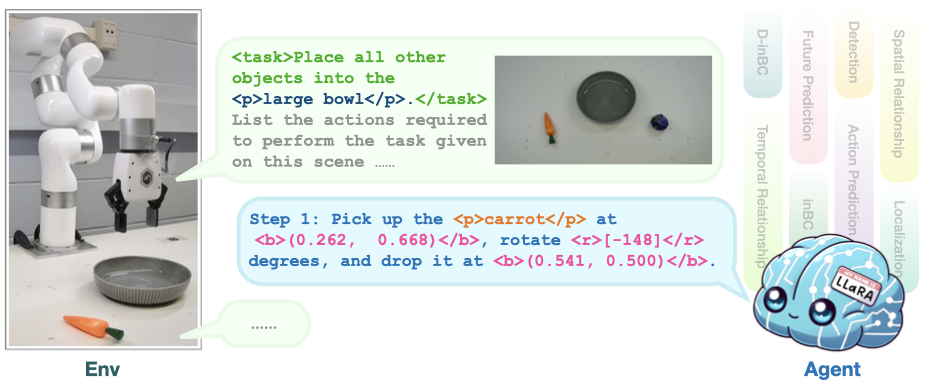
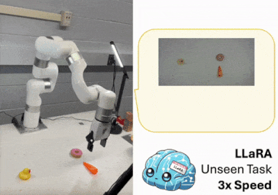

# LLaRA: Large Language and Robotics Assistant

This repository contains the official implementation of ICLR'25 paper: 

**LLaRA: Supercharging Robot Learning Data for Vision-Language Policy** \[[Arxiv](https://arxiv.org/abs/2406.20095)\]

[Xiang Li](https://xxli.me)<sup>1</sup>, [Cristina Mata](https://openreview.net/profile?id=~Cristina_Mata1)<sup>1</sup>, [Jongwoo Park](https://github.com/jongwoopark7978)<sup>1</sup>, [Kumara Kahatapitiya](https://www3.cs.stonybrook.edu/~kkahatapitiy)<sup>1</sup>, [Yoo Sung Jang](https://yjang43.github.io/)<sup>1</sup>, [Jinghuan Shang](https://elicassion.github.io/)<sup>1</sup>, [Kanchana Ranasinghe](https://kahnchana.github.io/)<sup>1</sup>, [Ryan Burgert](https://ryanndagreat.github.io/)<sup>1</sup>, [Mu Cai](https://pages.cs.wisc.edu/~mucai/)<sup>2</sup>, [Yong Jae Lee](https://pages.cs.wisc.edu/~yongjaelee/)<sup>2</sup>, and [Michael S. Ryoo](http://michaelryoo.com/)<sup>1</sup>

<sup>1</sup>Stony Brook University  <sup>2</sup>University of Wisconsin-Madison 



## Demo of real-world zero-shot experiments
<p float="left">
  
   
  
   
</p>

## Prerequisites

1. **Set Up Python Environment**:

   Follow the following instructions to install the same Python environment as used by [LLaVA](https://github.com/haotian-liu/LLaVA). 
   ```
   conda create -n llara python=3.10 -y
   conda activate llara
   conda install pytorch==2.1.2 torchvision==0.16.2 torchaudio==2.1.2 pytorch-cuda=12.1 -c pytorch -c nvidia
   conda install cuda=12.1 cuda-compiler=12.1 cuda-nvcc=12.1 cuda-version=12.1 -c nvidia
   ```

2. **Install Revised LLaVA**:

   Navigate to `train-llava` in this repo and install the llava package there:
   ```
   cd train-llava && pip install -e ".[train]"
   pip install flash-attn --no-build-isolation
   ```

3. **Install VIMABench**:

   Complete the setup for [VIMABench](https://github.com/vimalabs/VIMABench).
   ```
   git clone https://github.com/vimalabs/VimaBench && cd VimaBench
   pip install -e .
   ```

## Try a pretrained LLaRA

0. **Minimum Hardware Requirement**:
- Inference: One GPU with a minimum of 24GB RAM.
- Full parameter finetuning: A system with at least 300GB of system RAM and 4 Ampere (or newer) GPUs, each equipped with a minimum of 24GB of memory.
- Finetune via LoRA: One GPU with a minimum of 24GB RAM.

1. **Download the Pretrained Model**:

   Download the following model to `./checkpoints/`
   - llava-1.5-7b-D-inBC + Aux(B) trained on VIMA-80k [Hugging Face](https://huggingface.co/variante/llava-1.5-7b-llara-D-inBC-Aux-B-VIMA-80k)

   More models are available at [Model Zoo](./checkpoints/README.md)

2. **Run the evaluation**:

   ```
   cd eval
   # evaluate the model with oracle object detector
   python3 eval-llara.py D-inBC-AuxB-VIMA-80k --model-path ../checkpoints/llava-1.5-7b-llara-D-inBC-Aux-B-VIMA-80k --prompt-mode hso
   
   # the results will be saved to ../results/[hso]D-inBC-AuxB-VIMA-80k.json
   ```

3. **Check the results**:
   Please refer to [llara-result.ipynb](./results/llara-result.ipynb)

## Train your own LLaRA

1. **Prepare the Dataset**:

   Visit the [datasets directory](./datasets/README.md) to prepare your dataset for training.

2. **Finetune a LLaVA Model**:

   To start finetuning a LLaVA model, refer to the instructions in [train-llava](./train-llava/README.md).

3. **Evaluate the Trained Model**:

   Follow the steps in [eval](./eval/README.md) to assess the performance of your trained model.

4. **Train a MaskRCNN for Object Detection**:

   If you want to train a MaskRCNN for object detection, check out [train-maskrcnn](./train-maskrcnn/README.md) for detailed steps.

## Still some things unclear?

If you encounter any issues or have questions about the project, please submit an issue on our [GitHub issues page](https://github.com/LostXine/LLaRA/issues).

## License

This project is licensed under the [Apache-2.0 License](LICENSE) - see the LICENSE file for details.

## Support us

If you find this work useful in your research, please consider giving it a star ⭐ and cite our work:

```bibtex
@article{li2024llara,
  title={LLaRA: Supercharging Robot Learning Data for Vision-Language Policy},
  author={Li, Xiang and Mata, Cristina and Park, Jongwoo and Kahatapitiya, Kumara and Jang, Yoo Sung and Shang, Jinghuan and Ranasinghe, Kanchana and Burgert, Ryan and Cai, Mu and Lee, Yong Jae and Ryoo, Michael S.},
  journal={arXiv preprint arXiv:2406.20095},
  year={2024}
}
```
Thanks!
